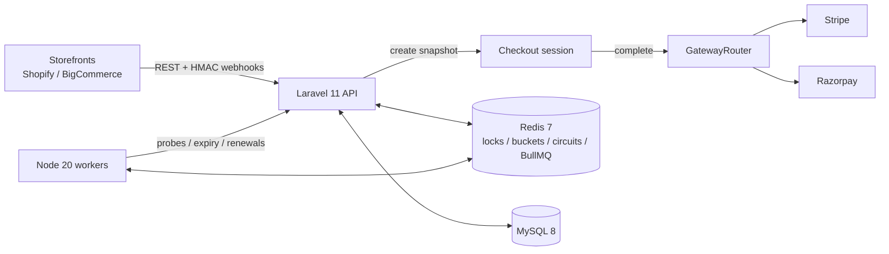

# CheckoutHub

High-volume eCommerce checkout orchestration: subscription offers, upsells, and payment gateway failover across Shopify and BigCommerce storefronts.

## Architecture



Charge path:

1. `POST /api/v1/checkouts` freezes an offer snapshot (trial, upsells, discount, proration) and TTL.
2. `POST /api/v1/checkouts/{id}/complete` transitions `pending -> authorizing -> complete|failed`.
3. `SET lock:charge:{checkoutId} NX PX` so a checkout cannot be charged twice.
4. Gateways are tried in priority order; open circuits and hard failures failover atomically.
5. Success creates a subscription and enqueues an outbound webhook (`Idempotency-Key`).

## Layout

| Path | Role |
|---|---|
| `api/` | Laravel 11 (PHP 8.3) core API and orchestration |
| `worker/` | Node.js 20 BullMQ consumers |
| `docker-compose.yml` | `app`, `worker`, `mysql`, `redis` |

## Setup

```bash
docker compose up --build
```

API: `http://localhost:8000`

Seeded demo store API key:

```
ch_live_demo_a1b2c3d4e5f6
```

```bash
KEY="ch_live_demo_a1b2c3d4e5f6"

curl -s -H "X-Api-Key: $KEY" http://localhost:8000/api/v1/offers | jq

CHECKOUT=$(curl -s -H "X-Api-Key: $KEY" -H "Idempotency-Key: demo-1" \
  -H "Content-Type: application/json" \
  -d '{"offer_id":1,"customer_email":"buyer@example.com","discount_code":"SAVE20"}' \
  http://localhost:8000/api/v1/checkouts)

echo "$CHECKOUT" | jq
ID=$(echo "$CHECKOUT" | jq -r .data.id)

curl -s -H "X-Api-Key: $KEY" \
  -X POST "http://localhost:8000/api/v1/checkouts/$ID/complete" | jq
```

Inbound webhooks (HMAC, idempotent):

```bash
# Shopify: X-Shopify-Hmac-Sha256 = base64(HMAC-SHA256(raw_body, webhook_secret))
# BigCommerce: X-BC-Webhook-Signature, or a signed_payload field
# Duplicate provider+event_id returns 200 immediately
```

Force a Stripe outage and watch Razorpay take over:

```bash
docker compose exec app php artisan checkouthub:circuit stripe open
docker compose exec app php artisan checkouthub:try-charge
docker compose exec app php artisan checkouthub:circuit stripe closed
```

## Tests

Redis must be reachable (`docker compose up -d redis`).

```bash
docker compose up -d redis
docker run --rm --network checkouthub_default \
  -v "$PWD/api:/app" -w /app \
  -e REDIS_HOST=redis \
  composer:2 php vendor/bin/pest
```

Pest covers failover, circuit breaker, token bucket, checkout idempotency, pricing, completion, expiry sweep, and inbound webhook HMAC/dedupe.

## Redis keys

| Key | Purpose |
|---|---|
| `cb:{gateway}:state` | `closed` / `open` / `half_open` |
| `cb:{gateway}:failures` | `INCR` window counter |
| `cb:{gateway}:opened_at` | Unix ms when opened |
| `cb:{gateway}:probe` | half-open single-flight lock |
| `cb:{gateway}:latency_ema` | latency EMA |
| `cb:{gateway}:health` | 0–100 score |
| `tb:{bucket}` | token bucket hash |
| `lock:charge:{checkoutId}` | charge mutex |
| `idem:checkout:{storeId}:{key}` | checkout create idempotency |
| `checkouthub:jobs:*` | Laravel → worker job lists |

## API

| Method | Path | Auth |
|---|---|---|
| `GET` | `/api/v1/health` | public — breaker snapshots |
| `POST` | `/api/v1/webhooks/shopify` | `X-Shopify-Hmac-Sha256` |
| `POST` | `/api/v1/webhooks/bigcommerce` | `X-BC-Webhook-Signature` or signed payload |
| `POST` | `/api/v1/checkouts` | `X-Api-Key` + optional `Idempotency-Key` |
| `GET` | `/api/v1/checkouts/{id}` | `X-Api-Key` |
| `POST` | `/api/v1/checkouts/{id}/complete` | `X-Api-Key` |
| `GET` | `/api/v1/offers` | `X-Api-Key` |
| `GET` | `/api/v1/subscriptions` | `X-Api-Key` |
| `GET` | `/api/v1/gateway-events` | `X-Api-Key` |
| `POST` | `/api/v1/internal/gateways/probe` | worker bearer token |
| `POST` | `/api/v1/internal/checkouts/expire` | worker bearer token |
| `POST` | `/api/v1/internal/subscriptions/renew` | worker bearer token |
